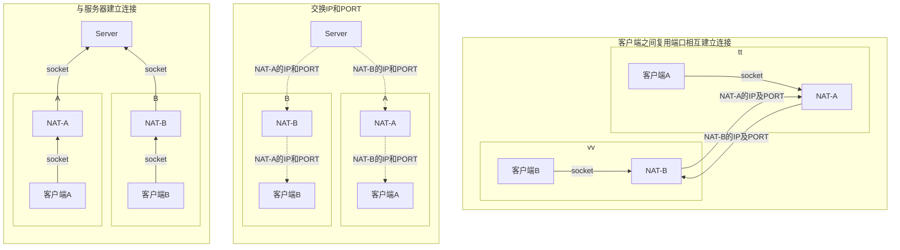
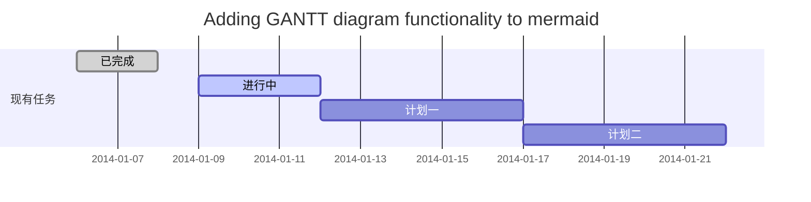
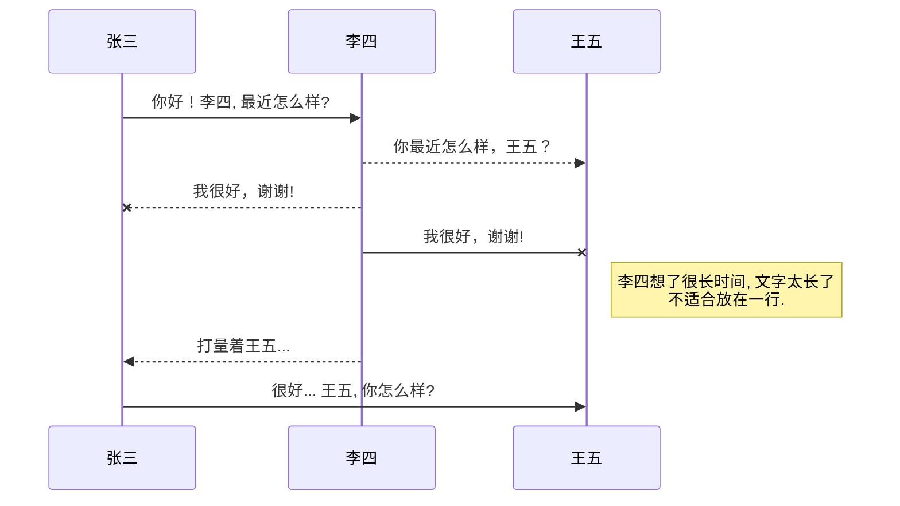
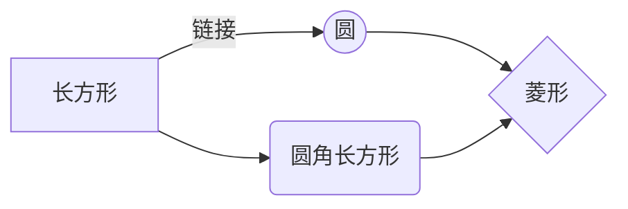

# 点对点传输工具

你好！ 这是一款TCP点对点的传输工具，由一个服务端程序和多个客户端组成，服务端仅在客户端配对时发挥作用，客户端建立连接后将不再与服务端发生数据传输。目前命名为 **P2P**。初步将支持 **Android** 客户端之间的连接与传输。

## 基本原理

两个客户端通过与临时服务器Server建立socket连接，让Server知道客户端的公网IP地址与端口，随后Server分别告诉客户端其对方客户端的公网IP和端口，客户端得到该信息后需要同时与对方发起socket连接（必须要复用与服务器连接的那个端口）。双方成功建立连接则代表功能实现，此时客户端之间可直接通信，与服务器之间的连接也可断开。


## 服务端功能需求
1. 临时存储连接方的连入信息
2. 仅为配对的两个客户端交换连接信息
3. 断开超过一定时间未配对成功的连接并删除连入信息
4. 统计连接数
5. 不允许不符合要求的客户端连入

## 客户端-服务端报文设计
<h4>帧结构</h4>   <!--标题-->
<table>
<tr>
  <th align="center" rowspan="2">帧头</th>
  <th align="center" colspan="4">数据域</th>
  <th align="center" rowspan="2">检验位（累加）</th>
</tr>
<tr>
<td>帧总长度（大端）</td>
<td>当前时间戳（毫秒）</td>
<td>帧类型</td>
<td>数据信息</td>
</tr>
<tr>
<td>0x05 0x11</td>
<td>2字节</td>
<td>8字节</td>
<td>1字节</td>
<td>...</td>
<td>1字节</td>
</tr>
</table>

- 注册帧01    
<table>
<tr>
  <th rowspan="2">帧类型</th>
  <th colspan="2">数据信息(dataArea) 下标13</th>
</tr>
<tr>
  <td>认证字段</td>
  <td>匹配码</td>
</tr>
<tr>
  <td>0x01</td>
  <td>4字节</td>
  <td>...</td>
</tr>
</table>

- 配对响应帧02
<table>
<tr>
  <th rowspan="2">帧类型</th>
  <th colspan="3">数据信息(dataArea) 下标13</th>
</tr>
<tr>
  <td>IP</td>
  <td>端口</td>
  <td>预定连接时间</td>
</tr>
<tr>
  <td>0x02</td>
  <td>4字节</td>
  <td>2字节</td>
  <td>8字节</td>
</tr>
</table>

## 服务端数据结构
HashMap：配对码 - (ip、port、socket、连入时间)

我们对Markdown编辑器进行了一些功能拓展与语法支持，除了标准的Markdown编辑器功能，我们增加了如下几点新功能，帮助你用它写博客：
1. **全新的界面设计** ，将会带来全新的写作体验；
2. 在创作中心设置你喜爱的代码高亮样式，Markdown **将代码片显示选择的高亮样式** 进行展示；
3. 增加了 **图片拖拽** 功能，你可以将本地的图片直接拖拽到编辑区域直接展示；
4. 全新的 **KaTeX数学公式** 语法；
5. 增加了支持**甘特图的mermaid语法[^1]** 功能；
6. 增加了 **多屏幕编辑** Markdown文章功能；
7. 增加了 **焦点写作模式、预览模式、简洁写作模式、左右区域同步滚轮设置** 等功能，功能按钮位于编辑区域与预览区域中间；
8. 增加了 **检查列表** 功能。
   [^1]: [mermaid语法说明](https://mermaidjs.github.io/)

## 功能快捷键

撤销：<kbd>Ctrl/Command</kbd> + <kbd>Z</kbd>
重做：<kbd>Ctrl/Command</kbd> + <kbd>Y</kbd>
加粗：<kbd>Ctrl/Command</kbd> + <kbd>B</kbd>
斜体：<kbd>Ctrl/Command</kbd> + <kbd>I</kbd>
标题：<kbd>Ctrl/Command</kbd> + <kbd>Shift</kbd> + <kbd>H</kbd>
无序列表：<kbd>Ctrl/Command</kbd> + <kbd>Shift</kbd> + <kbd>U</kbd>
有序列表：<kbd>Ctrl/Command</kbd> + <kbd>Shift</kbd> + <kbd>O</kbd>
检查列表：<kbd>Ctrl/Command</kbd> + <kbd>Shift</kbd> + <kbd>C</kbd>
插入代码：<kbd>Ctrl/Command</kbd> + <kbd>Shift</kbd> + <kbd>K</kbd>
插入链接：<kbd>Ctrl/Command</kbd> + <kbd>Shift</kbd> + <kbd>L</kbd>
插入图片：<kbd>Ctrl/Command</kbd> + <kbd>Shift</kbd> + <kbd>G</kbd>
查找：<kbd>Ctrl/Command</kbd> + <kbd>F</kbd>
替换：<kbd>Ctrl/Command</kbd> + <kbd>G</kbd>

## 合理的创建标题，有助于目录的生成

直接输入1次<kbd>#</kbd>，并按下<kbd>space</kbd>后，将生成1级标题。
输入2次<kbd>#</kbd>，并按下<kbd>space</kbd>后，将生成2级标题。
以此类推，我们支持6级标题。有助于使用`TOC`语法后生成一个完美的目录。

## 如何改变文本的样式

*强调文本* _强调文本_

**加粗文本** __加粗文本__

==标记文本==

~~删除文本~~

> 引用文本

H~2~O is是液体。

2^10^ 运算结果是 1024.

## 插入链接与图片

链接: [link](https://www.csdn.net/).

图片: 

带尺寸的图片: 

居中的图片: 

居中并且带尺寸的图片: 

当然，我们为了让用户更加便捷，我们增加了图片拖拽功能。

## 如何插入一段漂亮的代码片

去[博客设置](https://mp.csdn.net/console/configBlog)页面，选择一款你喜欢的代码片高亮样式，下面展示同样高亮的 `代码片`.
```javascript
// An highlighted block
var foo = 'bar';
```

## 生成一个适合你的列表

- 项目
    - 项目
        - 项目

1. 项目1
2. 项目2
3. 项目3

- [ ] 计划任务
- [x] 完成任务

## 创建一个表格
一个简单的表格是这么创建的：
项目     | Value
-------- | -----
电脑  | $1600
手机  | $12
导管  | $1

### 设定内容居中、居左、居右
使用`:---------:`居中
使用`:----------`居左
使用`----------:`居右
| 第一列       | 第二列         | 第三列        |
|:-----------:| -------------:|:-------------|
| 第一列文本居中 | 第二列文本居右  | 第三列文本居左 |

### SmartyPants
SmartyPants将ASCII标点字符转换为“智能”印刷标点HTML实体。例如：
|    TYPE   |ASCII                          |HTML
|----------------|-------------------------------|-----------------------------|
|Single backticks|`'Isn't this fun?'`            |'Isn't this fun?'            |
|Quotes          |`"Isn't this fun?"`            |"Isn't this fun?"            |
|Dashes          |`-- is en-dash, --- is em-dash`|-- is en-dash, --- is em-dash|

## 创建一个自定义列表
Markdown
:  Text-to-HTML conversion tool

Authors
:  John
:  Luke

## 如何创建一个注脚

一个具有注脚的文本。[^2]

[^2]: 注脚的解释

##  注释也是必不可少的

Markdown将文本转换为 HTML。

*[HTML]:   超文本标记语言

## KaTeX数学公式

您可以使用渲染LaTeX数学表达式 [KaTeX](https://khan.github.io/KaTeX/):

Gamma公式展示 $\Gamma(n) = (n-1)!\quad\forall
n\in\mathbb N$ 是通过欧拉积分

$$
\Gamma(z) = \int_0^\infty t^{z-1}e^{-t}dt\,.
$$

> 你可以找到更多关于的信息 **LaTeX** 数学表达式[here][1].

## 新的甘特图功能，丰富你的文章


- 关于 **甘特图** 语法，参考 [这儿][2],

## UML 图表

可以使用UML图表进行渲染。 [Mermaid](https://mermaidjs.github.io/). 例如下面产生的一个序列图：



这将产生一个流程图。:



- 关于 **Mermaid** 语法，参考 [这儿][3],

## FLowchart流程图

我们依旧会支持flowchart的流程图：
```mermaid
flowchat
st=>start: 开始
e=>end: 结束
op=>operation: 我的操作
cond=>condition: 确认？

st->op->cond
cond(yes)->e
cond(no)->op
```

- 关于 **Flowchart流程图** 语法，参考 [这儿][4].

## 导出与导入

###  导出
如果你想尝试使用此编辑器, 你可以在此篇文章任意编辑。当你完成了一篇文章的写作, 在上方工具栏找到 **文章导出** ，生成一个.md文件或者.html文件进行本地保存。

### 导入
如果你想加载一篇你写过的.md文件，在上方工具栏可以选择导入功能进行对应扩展名的文件导入，
继续你的创作。

[1]: http://meta.math.stackexchange.com/questions/5020/mathjax-basic-tutorial-and-quick-reference
[2]: https://mermaidjs.github.io/
[3]: https://mermaidjs.github.io/
[4]: http://adrai.github.io/flowchart.js/